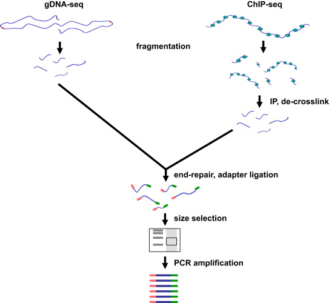
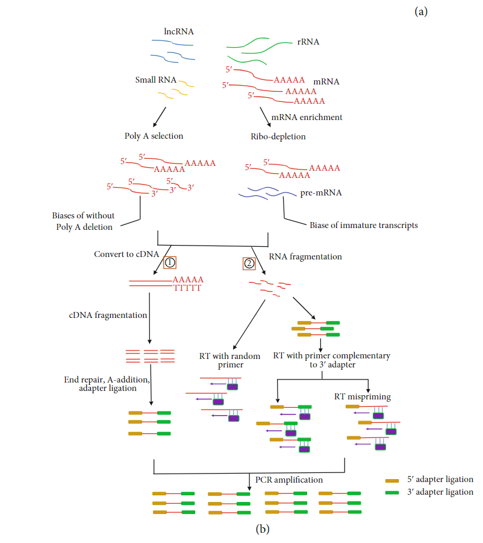

.. _Introduction to genome browsers:

*******************
1 Introduction to Genome Browsers
*******************

Types of Genome Browsers
================================

As sequencing technologies improve and the number of sequenced genomes increases, a need for exploring, comparing, and examining this data emerges. 
A solution to this need led to the development of genome browsers. A genome browser is a program that stores the sequence and annotations of a species, 
allowing researchers from various fields to access, search, retrieve, and analyze this data in a graphical way. 

A genome browser is an interactive tool that enables researchers to visualize and navigate genomic sequences and their annotations. 
It provides a graphical interface to explore genes, regulatory elements, variations, and comparative genomics data within a genome. 
By integrating diverse datasets, genome browsers allow users to:

Genome browsers are divided into web-based browsers and standalone applications. In this course, we will focus on the first type.

Web-based
-----------
Accesible online, regularly updated:

	**UCSC Genome Browser**

	**Ensembl**

	**NCBI Genome Data Viewer**

Also, Several genome browsers have been designed for specific organisms, providing specialized resources. Most of these correspond to model experimental species. 
Some examples are:

	- **FlyBase Genome Browser**: For *Drosophila melanogaster* (fruit fly).
	- **WormBase Genome Browser**: For *Caenorhabditis elegans* (nematode worm).
	- **TAIR Genome Browser**: For *Arabidopsis thaliana* (thale cress).
	- **MaizeGDB Genome Browser**: For *Zea mays* (maize).
	- **Gramene Genome Browser**: Focused on plant genomes like rice, wheat, and barley.
	- **Saccharomyces Genome Database (SGD)**: For *Saccharomyces cerevisiae* (baker's yeast).
	- **Rat Genome Database (RGD)**: For *Rattus norvegicus* (rat).
	- **ZFIN Genome Browser**: For *Danio rerio* (zebrafish).
	- **Mouse Genome Informatics (MGI) Browser**: For *Mus musculus* (mouse).
	- **Echinobase**: For echinoderms like sea urchins.
	- **Cattle Genome Database**: For *Bos taurus* (cattle).

Software-based
--------------
Applications installed on local machines, recommended when working with large datasets or new genome assemblies. 

	**Integrative Genomic Viewer (IGV)**

	**Artemis**

	**Genome Workbench**

Genome assembly codification
=============================

This difference in chromosome naming can affect how genomic coordinates are interpreted and may require conversion when switching between 
resources or tools that use different conventions (as variant calling or variant annotation tools).

.. note::
	For chromosome naming:

	- UCSC uses "chr" prefix (e.g., chr1, chr2, chrX)
	- Ensembl uses numbers or letters without prefix (e.g., 1, 2, X)
	
	This difference in chromosome naming can affect how genomic coordinates are interpreted and may require conversion when switching between resources or tools that use different conventions.	

UCSC Codification
------------------

Ensembl uses a naming convention that includes the species and the version of the genome. The current genome assembly is referred to as GRCh38.p14, while the previous genome is referred to as GRCh37. For the first name the codification is:

- GRC stands for Genome Reference Consortium
- h stands for human
- 38 indicates the 38th version
- p.14 denotes the 14th patch (small updates that do not affect the assembly coordinates but correct specific regions or add annotations). This feature provides a more detailed versioning system.

Ensembl Codification
------------------

UCSC uses a simplified naming system. For the current human genome assembly, it refers to it as hg38 (Homo sapiens genome build 38), and for the previous version as hg19.

This naming difference stems from the fact that Ensembl tends to mirror official genome releases like those from the GRC,
while UCSC focuses on providing stable assembly versions. Patches or updates in UCSC are referred to as separate tracks.
This means that users working with hg38 may not be automatically aware of any minor updates unless they manually explore the tracks.

DNA library bias
================

Depending on template, DNA-Seq can include Whole Genome Sequencing (WGS), Whole Exome Sequencing (WES),, Epigenome Sequencing (ChIP-Seq, WGBS) or Targeted Sequencing (TS). 
Among the different library preparation steps presented earlier, several biases can be introduced during the process. 
Here are presented the main biases introduced for DNA in each library preparation step and possible solutions to avoid them.

- **Fragmentation**

Chromatin sonication for ChIP-seq has been shown to be non-random, with euchromatin being sheared more efficiently than heterochromatin.

.. tip::
	To solve this it has been developed the double-fragmentation ChIP-seq protocol.

- **Size Selection**

Agarose gel slices by heating to 50 ºC in chaotropic salt buffer decreased the representation of AT-rich sequences.

.. tip:: 
	Simple solution to this problem is to melt the gel slices in the supplied buffer at room temperature (18–22 ºC), considerably reducing GC bias.

- **PCR**

Introduce bias in sample composition, due to the fact that not all fragments in the mixture are amplified with the same efficiency. 
GC-neutral fragments are amplified more efficiently than GC-rich or AT-rich fragments, and as a result fragments with high AT- or GC content may become underrepresented or are completely lost during library preparation

.. tip::
	- Ligate adapters that contain all necessary elements for bridge amplification on Illumina flowcells are preferred, eliminating the need for PCR to add these sequences afterwards. Nevertheless, requires relatively large quantities (41 mg) of input material.
	- In the extreme case of small input amount, the single cell,multiple displacement amplification (MDA) may be the preferred amplification method. MDA is an extremely powerful amplification method, allowing microgram quantities of DNA to be obtained from femtograms of starting material. For this reason, MDA has become the method of choice for whole genome amplification (WGA) from single cells
	- PCR additives have also been reported to reduce bias, such as betaine or tetramethylammonium chloride (TMAC) may help to further improve coverage of extremely GC-rich or AT-rich regions.
	- The best overall performing polymerase appears to be Kapa HiFi.

.. seealso::
	For more information see the publication `Library preparation methods for next generation sequencing: Tone down the bias <http://dx.doi.org/10.1016/j.yexcr.2014.01.008>`_.
	            
RNA library bias
================

On this section are presented the main source of bias in RNA-seq, and the solutions that could be implemented to reduce it. 

**Sample Preservation and Isolation**
--------------------------------------	

1. Degradation of RNA:

.. tip:: 
	Minimizing the sample processing and freezing and thawing cycles, ensures that RNA is preserved as best as possible. 

2. RNA extraction:

.. tip::
	If possible use high concentrations of RNA samples or avoid TRIzol extraction altogether. 

**Library Construction**
-------------------------

1. **Low-quality and/or low-quantity RNA samples**: 

.. tip::
	RNase H has been the best method for detecting low-qualityRNA and even could effectively replace the standard RNA-seq method based on oligo (dT). 
	For low-quantity RNA,the SMART and NuGEN approaches had lower duplication rates and significantly decreased the necessary amount of starting material compared to other methods.

2. **mRNA enrichment bias**: In eukaryotes enrich for polyadenylated RNA transcripts with oligo (dT) primers have shown that this method remove all non-poly (A) RNAs, such a reolication-dependant histones and lncRNAs (lacking of polyA),or incomplete mRNAs. 

.. tip::
	Targeting rRNA as depletion method will not limit to only mRNA molecules, may capture more immature transcripts, leading to a complexity increase of sequencing data (also is more expensive). 
	Subtractive hybridization using rRNA-specific probes as the method that introduced the least bias in relative transcript abundance,

3. **RNA fragmentation bias**: There are two major approaches of RNA fragmentation: chemical (using metal ions) and enzymatic (using RNase III). During this process could be introduced lenght biases or errors (propagated to later cycles).

.. tip:: 
	Studies have shown that methods that involve non specific restriction endonucleases indicate less sequence bias and have been shown to perform similarly to the physical methods. Also enzymatic methoda are easy to automate 

4. **Primer bias**: During reverse transcription into cDNA by random hexamers can lead to deviation of nucleotide content of RNA sequencing reads, resulting in low complexity of RNA sequencing data.

.. tip::
	Could be avoid using the Illumina Genome Analyzer, which perform the reverse transcription directly on the flowcells, avoiding the PCR.
	Also has been proposed a bioinformatics tool in a reweighing scheme to adjust for the bias and make the distribution of the reads more uniform.

5. **Adapter ligation bias**: Adapter ligation introduces a significant but widely overlooked bias in the results of NGS small RNA sequencing.
   
.. tip:: 
	As a solution, several groups propose to randomize the 3' end of the 5'adapter and the 5'end of the 3'adapter. 
	The strategy is based on the hypothesis that a population of degenerate adapters would average out the sequencing bias because the slightly different adapter molecules would form stable secondary structures with a more diverse population of RNAsequences		- Reverse transcription bias: reverse transcriptases tend to produce false second strand cDNA throughDNA-dependent DNA polymerase. ActinomycinD, a compound that specifically inhibits DNA-dependent DNAsynthesis, has been proposed as an agent to eliminate antisense artifacts

6. **Reverse Transcription**: A known feature of reverse transcriptases is that they tend to produce false second strand cDNA through DNA-dependent DNA polymerase. This may not be able to distinguish the sense and antisense transcript and create difficulties for the data analysis.

.. tip::
	- The deoxyuridine triphosphate (dUTP) method, one of the leading cDNA-based strategies, can be specifically removed by enzymatic digestion
	- Another method is to synthesize the first strand of cDNA using labeled random hexamer primer and SSS using DNA-RNA template-switching primer

7. **PCR amplification bias**: main source of artifacts and base composition bias in the process of library construction:

	7.1. Extremely AT/GC-Rich: Fragments of GC-neutral can be amplified more than GC-rich or AT-rich fragments. 

	.. tip::
		- Through the use of custom adapters, the samples without amplification and ligation can be hybridized directly with the oligonucleotides on the flowcell surface, thus avoiding the biases and duplicates of PCR. 
		- However, the amplification-free method requires high sample input, which limits its widely used. The most effective PCR enhancing additives currently used are betaine. 
		It is an amino acid mimic that acts to balance the differential T m between AT and GC base pairs and has been effectively used to improve the coverage of GC-rich templates
		- Presence of tetramethylammonium chloride (TMAC) showed that can remarkably increase the amplification of AT-rich regions in Kapa HiFi in the presence. Additionally, 
		a number of additives have been reported to play an important role in reducing the bias of PCR ampli-fication, including small amides such as formamide, small sulfoxides such as dimethyl sulfoxide (DMSO), 
		or reducingcompounds such as β-mercaptoethanol or dithiothreitol(DTT).

	7.2. PCR cyle: PCR can exponentially amplify DNA/cDNA templates, thus leading to a significant increase of amplification bias with the number of PCR cycles. 

	.. tip:: 
		it is recommended that PCR be performedusing as few cycle numbers as possible to mitigation bias.

.. seealso::
	For more information see the publication `Library preparation methods for next generation sequencing Tone down the bias <http://dx.doi.org/10.1016/j.yexcr.2014.01.008>`_ and `Bias in RNA-seq Library Preparation: Current Challenges and Solutions <https://doi.org/10.1155/2021/6647597>`_.

