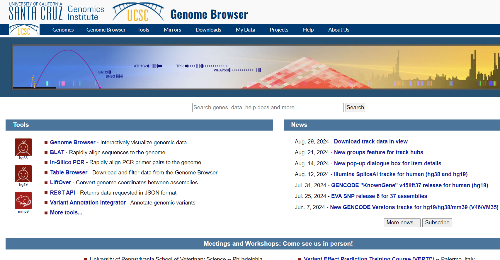

.. _Introduction to genome browsers:

*******************
1 UCSC
*******************

The UCSC Genome Browser is a web-based tool, developed by the University of California Santa Cruz in 2000. 
It was initially created to support the assembly and annotation of the human genome as part of the Human Genome Project.
Since then, it has evolved into a comprehensive resource for genomic data analysis. The browser stores and displays genomic sequences and annotations for various species, 
enabling researchers to access, search, retrieve, and analyze genetic data in a graphical format. This browser focuses on providing genome assemblies for extensively studied species such as humans, mice, 
and zebrafish. It offers detailed information on genome annotations for a select group of organisms, and has become an essential tool for genomics research worldwide. 

Navigation and general concepts
================================

Let's navigate to `UCSC <https://genome-euro.ucsc.edu/index.html>_`.

BLAT (Blast - Like Aligment Tool)
================================

Table Browser
==============

Liftover
==========

