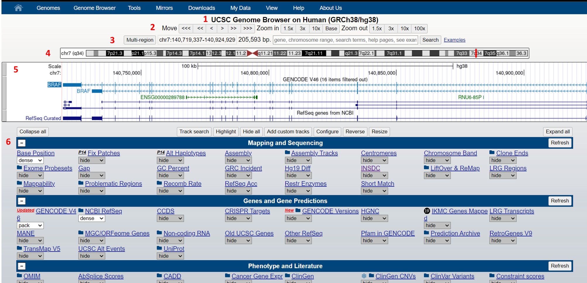
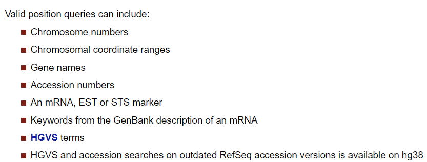
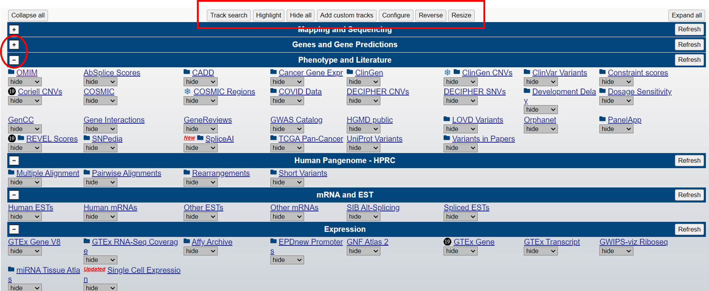
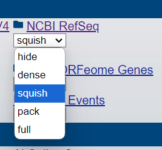
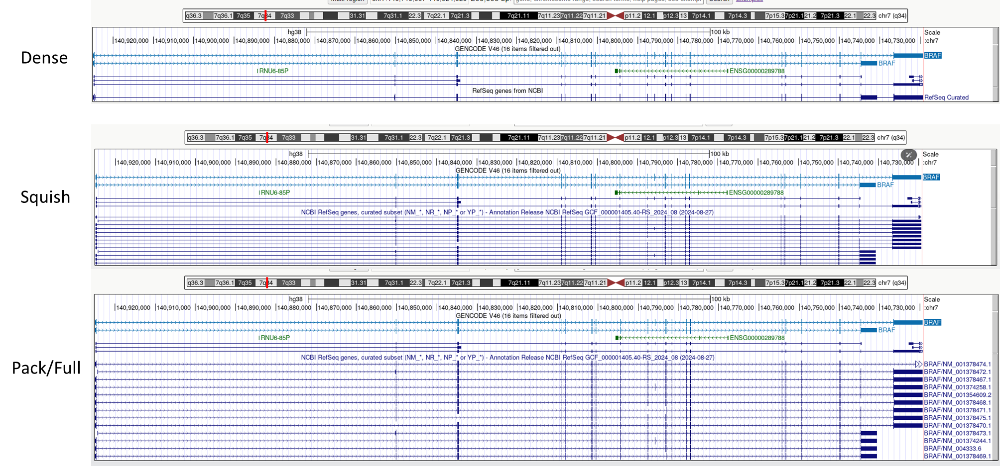

.. _Introduction to genome browsers:

*******************
1 UCSC
*******************

The UCSC Genome Browser is a web-based tool, developed by the University of California Santa Cruz in 2000. 
It was initially created to support the assembly and annotation of the human genome as part of the Human Genome Project.
Since then, it has evolved into a comprehensive resource for genomic data analysis. The browser stores and displays genomic sequences and annotations for various species, 
enabling researchers to access, search, retrieve, and analyze genetic data in a graphical format. This browser focuses on providing genome assemblies for extensively studied species such as humans, mice, 
and zebrafish. It offers detailed information on genome annotations for a select group of organisms, and has become an essential tool for genomics research worldwide. 

Navigation and general concepts
================================

Let's navigate to `UCSC <https://genome-euro.ucsc.edu/index.html>_`.

.. image:: images/homepage_ucsc.png
	:alt: UCSC Homepage
	:align: center

In the Genomes tab, select your organism of interest. Next, choose the desired version from the Assembly dropdown menu. You can then search for a specific genomic region by entering a gene name,
transcript, chromosome, or sequence.

For this tutorial, we'll focus on the Human Genome version **GRCh38/hg38 and the gene name BRAF**. After entering this information, 
you'll be redirected to a new window displaying the sequence and annotations on a genomic map.

From top to bottom, the different parts of the genome browser are:

**Navigation and Search Position**

1. Genome species and version (Assembly)
2. Base position scroll bar and zoom
3. Coordinates box of the current position (chromosome number: start - end position). You can navigate to another region by entering new coordinates or a position query in the search box. You can also find matches by track name or descriptions.

4. Current location on the chromosome is indicated in red. Clicking other positions will redirect you there.
5. Displayed annotation tracks
5. All available tracks grouped in annotation blocks

**Annotation Tracks (Appearance varies based on selected tracks)**

Tracks are grouped into annotation blocks. Each block contains several tracks from different primary sources, related by the function they annotate (e.g., Assembly, Genes, Phenotypes, Variance).

Each block of tracks can be hidden using the minus symbol on the left side.

At the top of the annotation block, we find different buttons that apply to all tracks, such as track search to look for a specific track, hide all tracks, and more.

Tracks can be displayed in various ways, showing different levels of detail (hide, dense, squish, pack, full). The main tracks for each block are presented below.

BLAT (Blast - Like Aligment Tool)
================================

Table Browser
==============

Liftover
==========

