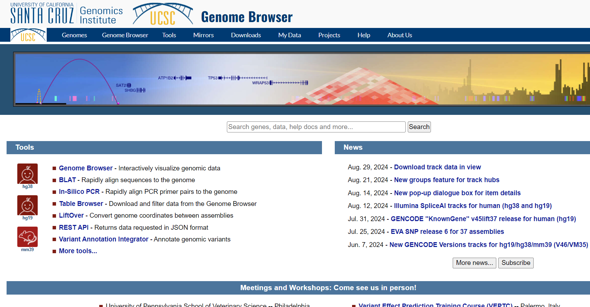
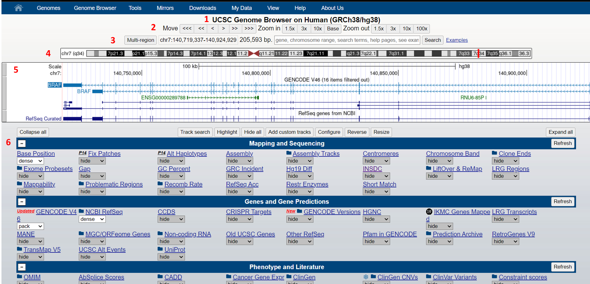
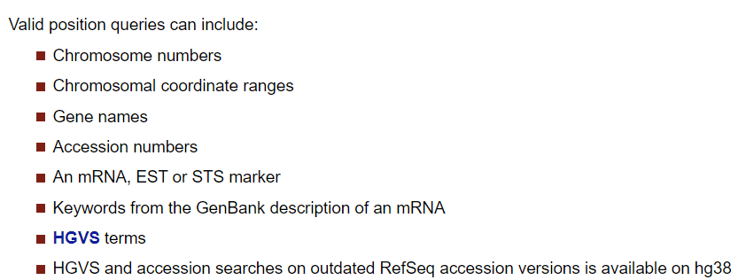
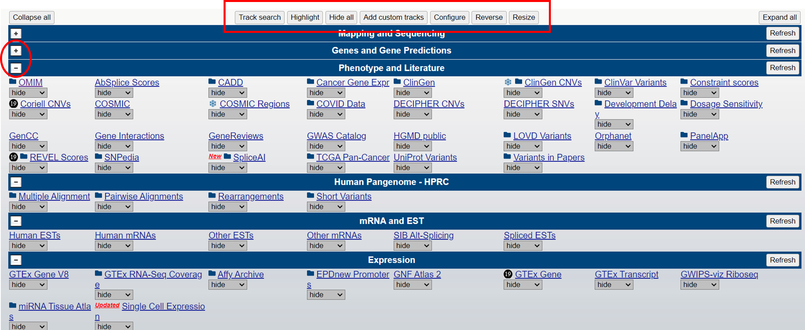
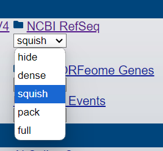
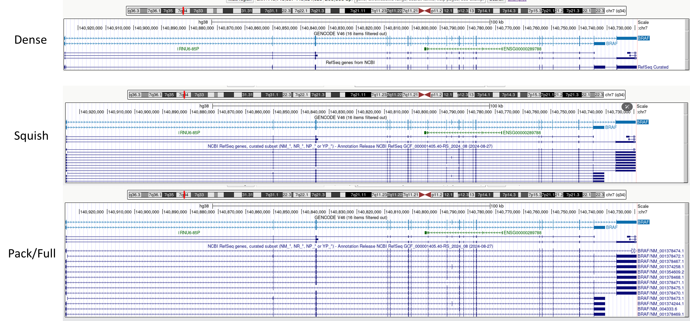
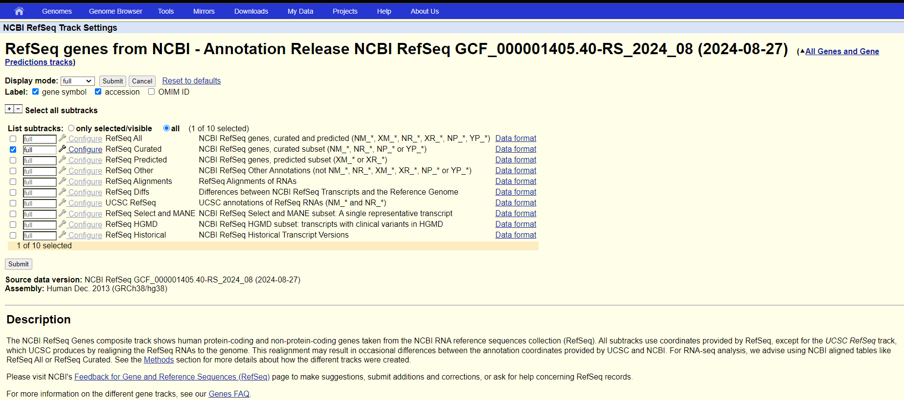
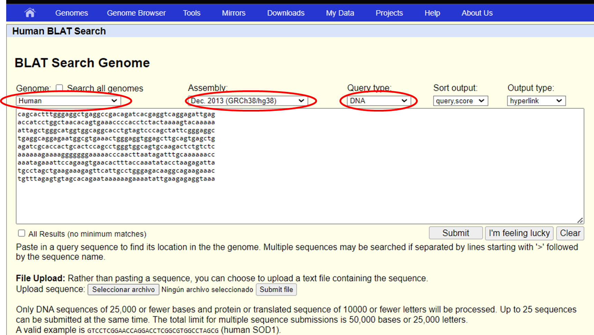

.. _Introduction to genome browsers:

*******************
1 UCSC
*******************

The UCSC Genome Browser is a web-based tool, developed by the University of California Santa Cruz in 2000. 
It was initially created to support the assembly and annotation of the human genome as part of the Human Genome Project.
Since then, it has evolved into a comprehensive resource for genomic data analysis. The browser stores and displays genomic sequences and annotations for various species, 
enabling researchers to access, search, retrieve, and analyze genetic data in a graphical format. This browser focuses on providing genome assemblies for extensively studied species such as humans, mice, 
and zebrafish. It offers detailed information on genome annotations for a select group of organisms, and has become an essential tool for genomics research worldwide. 

Navigation and general concepts
================================

Let's navigate to `UCSC <https://genome-euro.ucsc.edu/index.html>_`.

In the Genomes tab, select your organism of interest. Next, choose the desired version from the Assembly dropdown menu. You can then search for a specific genomic region by entering a gene name,
transcript, chromosome, or sequence.

For this tutorial, we'll focus on the Human Genome version **GRCh38/hg38 and the gene name BRAF**. After entering this information, 
you'll be redirected to a new window displaying the sequence and annotations on a genomic map.

From top to bottom, the different parts of the genome browser are:

**Navigation and Search Position**

1. Genome species and version (Assembly)
2. Base position scroll bar and zoom
3. Coordinates box of the current position (chromosome number: start - end position). You can navigate to another region by entering new coordinates or a position query in the search box. You can also find matches by track name or descriptions.

4. Current location on the chromosome is indicated in red. Clicking other positions will redirect you there.
5. Displayed annotation tracks
5. All available tracks grouped in annotation blocks

**Annotation Tracks (Appearance varies based on selected tracks)**

Tracks are grouped into annotation blocks. Each block contains several tracks from different primary sources, related by the function they annotate (e.g., Assembly, Genes, Phenotypes, Variance).

Each block of tracks can be hidden using the minus symbol on the left side.

At the top of the annotation block, we find different buttons that apply to all tracks, such as track search to look for a specific track, hide all tracks, and more.

Tracks can be displayed in various ways, showing different levels of detail (hide, dense, squish, pack, full). The main tracks for each block are presented below.

As commented, tracks are grouped in the following blocks (last update September 2024):

1. Mapping and Sequencing: Contains tracks related to how genomic sequences were aligned, assembled, and their quality and consistency.
    a. Sequence
    b. GC content
2. Genes and Gene Predictions: Tracks with information on known and predicted genes and alternative splicing isoforms.
    a. Gencode: Genes that are well-established based on experimental evidence
    b. RefSeq: Gene annotations provided by NCBI
3. Phenotypes and Literature:
    a. OMIM (Online Mendelian Inheritance in Man): Annotations related to Mendelian disorders and their linked genes
    b. ClinVar: Clinically significant variants linked to health conditions
4. Human Pangenome - HPRC: Genomic variation across diverse human populations, representing the full spectrum of human genetic diversity rather than a single reference
5. mRNA and EST (Expressed Sequence Tags): Focus on transcribed regions of the genome
    a. mRNA: Full-length mRNA transcripts that align to the genome
    b. EST: Partial transcripts that help identify actively transcribed parts of the genome and highlight alternative splicing
6. Expression: Tracks showing where and to what extent genes are expressed in different tissues or cell types
7. Single Cell RNA-seq: View of gene expression at the single-cell level, showing how individual cells within a tissue express different sets of genes
8. Regulation: Information about regulatory elements, such as promoters, enhancers, and transcription factor binding sites
9. Comparative Genomics: Comparison across genomes of other species
10. Variation: Genetic variation and polymorphisms
11. Repeats: Repetitive elements in the genome

To learn more about a specific track, click on its name. This will open a new tab containing detailed information about the track, 
including its description, display methods, data sources, references, and configuration options (such as representation and color settings).

In the following image we will find the settings for the RefSeq track:

Explore the different tracks and visualization you are interest in.
Following we will explore the main Tools UCSC offer to search, extract and convert genomic data. 

BLAT (Blast - Like Aligment Tool)
==================================

BLAT (BLAST-Like Alignment Tool) is a fast alignment tool used to find the genomic location of either a DNA or protein sequence. 
In this example, we will use a fragment of DNA sequence from the BRAF gene.

.. code-block:: sh

	cagcactttgggaggctgaggccgacagatcacgaggtcaggagattgag
	accatcctggctaacacagtgaaaccccacctctactaaaagtacaaaaa
	attagctgggcatggtggcaggcacctgtagtcccagctattcgggaggc
	tgaggcaggagaatggcgtgaaactgggaggtggagcttgcagtgagctg
	agatcgcaccactgcactccagcctgggtggcagtgcaagactctgtctc
	aaaaaagaaaagggggggaaaaacccaacttaatagatttgcaaaaaacc
	aaatagaaattccagaagtgaacactttaccaaatatacctaagagatta
	tgcctagctgaagaaagagttcattgcctgggagacaaggcagaagaaac
	tgtttagagtgtagcacagaataaaaaagaaaatattgaagagaggtaaa

1. Access BLAT by clicking on the Tools section 
2. Enter your sequence in the BLAT search text box
3. Select the genome species and version (assembly) you want to align with, and the type of sequence—in this case, DNA
    Submit your query

As a result, we obtain a list of matches, ordered in descending order by identity percentage. We can see a link in the "Action" column that redirects the page to the genome browser position of the matched sequence. 
	Additionally, the sequence coordinates are displayed as chromosome, strand, sequence start, and end.

4. A list of results that align with our query sequence will then appear. 

Table Browser
==============

This powerful tool, accessible in the Tools tab, enables users to retrieve data from UCSC in tabular format. The Table Browser offers a flexible interface for querying and downloading specific genomic datasets.

Key features of the Table Browser include:

- Customizable queries: Users can select specific genomic regions, genes, or entire chromosomes.
- Multiple output formats: Data can be exported in various formats such as BED, GTF, or custom formats.
- Filtering options: Apply filters to refine your search based on various criteria.
- Intersection and correlation: Compare data from different tracks or tables.

In this example, we are going to retrieve all the exons of the BRAF gene from the Human genome assembly hg38. This demonstrates how the Table Browser can be used to extract specific genomic features for further analysis.

As shown on the image:

- Fill the “Select datase” fields
- In Region select position and write down “BRAF”, then click on “Lookup”, and you will be redirect to another windows to select the gene name , 
and after the text in the box will be replace for the gene coordinates.

Liftover
==========

