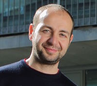
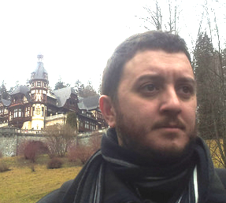

.. _home-page-about:

**************
About the course
**************

.. autosummary::
   :toctree: generated

  

.. list-table:: Main instructors:
   :widths: 50 50 50
   :header-rows: 1

   * - Luca Cozzuto
     - Toni Hermoso
     - Julia Ponomarenko
   * - |luca|
     - |toni|
     - |julia|

.. _home-page-dates

Dates, time, location
=========================

* Dates: 

* Location: 

Program
------------------------
  

.. _home-page-outline:

Outline
============

This Genome Browser course will train participants to understand the basics principles of the main web browser as UCSC, Ensembl, and the local browser IGV.

.. _home-page-learning:

Learning objectives
============

* 

.. _home-page-prereq:

Prerequisite / technical requirements
============

* Basic knowledge of genomics data formats (FASTA, GTF, VCF, BAM), follow the course `Linux commands and Genomics Data formats for biologists <https://biocorecrg.github.io/PhD_course_genomics_format_2024/>`_.

